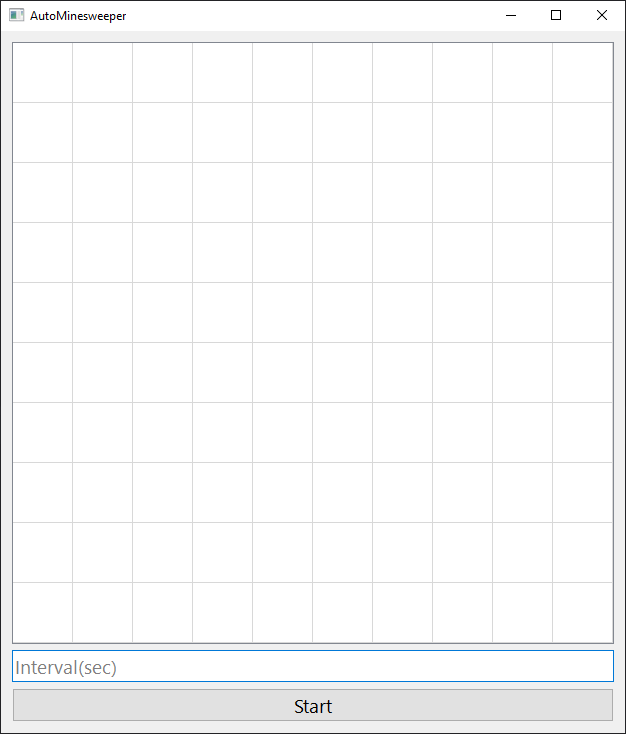
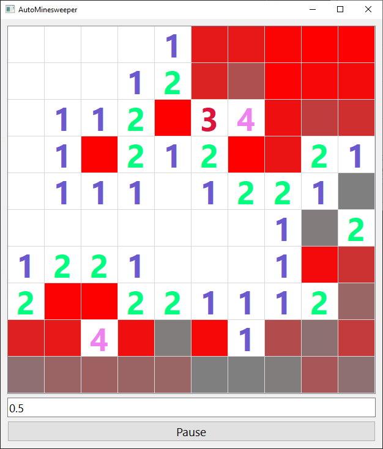

# AutoMinesweeper

This is a Minesweeper AI project implemented in Python, utilizing a deep learning approach with PyTorch. The AI is trained to play Minesweeper by predicting the safest cells to click based on the current game state.

# Main Packages

## deep_learning/

This directory contains all the modules related to the AI model.

## minesweeper_app/

This directory contains the code for the Minesweeper application with an AI player.

# How to Run

1. Train AI:
   
    Run command:
    ```
    python -m deep_learning.train <options>
    ```
    To see all available options:

    ```
    python -m deep_learning.train -h
    ```
2. TestAI:
   
    Run command:
    ```
    python -m deep_learning.test <options>
    ```
    To see all available options:

    ```
    python -m deep_learning.test -h
    ```
3. Minesweeper app:

    Run command:
    ```
    python -m minesweeper_app.minesweeper_gui
    ```

# Configuration

The AI model architecture and training parameters can be adjusted in the model.py and train_options.py files.

The Minesweeper game settings, such as board size and mine count, can be configured in the minesweeper_app/config.py file.

# Dependencies

- Python 3
- PyTorch
- NumPy
- PyQt6
- Numba

Install dependencies using: 

```
pip install -r requirements.txt
```

# Screenshots
<div style="text-align: center"> Start screen </div>

 
<hr>

 <div style="text-align: center"> Gameplay </div>
 

